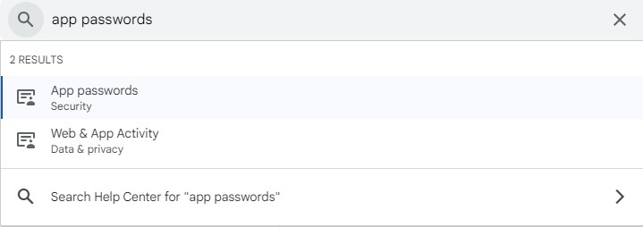
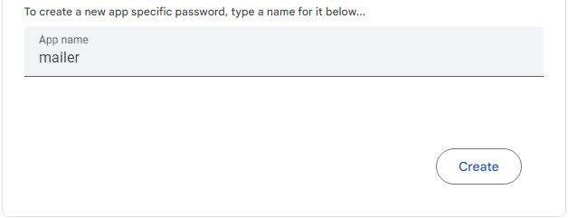
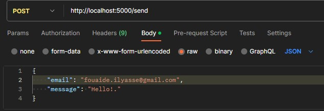

# Node Mailer

`nodemailer` is a module for Node.js that makes it easy to send emails from your Node.js applications

### `Step 1: Gmail Setup`
Open the [<ins>Account > Security</ins>](https://myaccount.google.com/security) page and scroll down to **Signing in to Google** section and make sure you enable   
`2-Step Verification`. Then you should see a new section called `‘App passwords’`. Click it.

**if you don't see App passwords section search it:**

  

when you click on **App passwords** section and sign in successfully, then create your app password.



Save the **16-digit** password.

### `Step 2: Getting Started`

1. use **git clone** to clone this repository:
```bash
git clone https://github.com/Ilyasse-Fouaide/Mailer.git
```

2. install dependencies:
```bash
npm install
```

3. create `.env` file and setup the global env variables
```
APP_PORT=5000
MAIL_USER=<your-email@gmail.com>
MAIL_PASS=<your-16-digit-password>
```

4. run the app
```bash
npm run dev  ### the app running at http://localhost:5000
```

5. test the end point: open `postman`:

